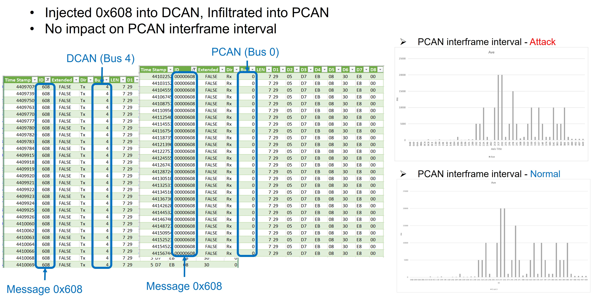

VitroBench is a comprehensive test platform involving commercial off-the-shelf (COTS) ECUs that allows arbitrary packet control over In Vehicle Networks (IVN). It allows replication of driving use cases and scenarios directly on the testbed involving COTS ECUs. This, in turn, allows us to design and evaluate concrete attacks that are directly related to a driving scenario. Our <a href="https://www.sciencedirect.com/science/article/pii/S2214209623000797">VitroBench paper</a> is published on Vehicular Communications, Volume 43 (October 2023).

<iframe class="table_image resize_table" width="560" height="auto" src="https://www.youtube.com/embed/5JA58Mpn1lg" frameborder="0" allowfullscreen></iframe>
  

### VitroBench Introduction

The primary objective of VitroBench is to facilitate the discovery and investigation of attacks that may impair the physical functions (e.g., display of speed, engine functionality) in a car. Capabilities such as sniffing and injection of modified packets are embodied in our test platform to control the communication in IVNs via an FPGA communication board and by hooking COTS ECUs via bare wires. The full control of the IVN communication is facilitated by bridging an ECU, intercepting any message involving the ECU and sending it to a workstation; and then send a possibly modified message back to the IVN.

<iframe class="table_image resize_table" width="560" height="auto"   src="https://www.youtube.com/embed/a7PQia7PuAk" frameborder="0" allowfullscreen></iframe>
 

### VitroBench Software

 The software for sniffing, injection or interception, and fuzzing or attacks is executed on the CAN Messages (CM) workstation. The sniffing software is from <a href="https://github.com/TOSUN-Shanghai/TSMaster">TSMaster</a>. The python programs for injection or interception, and fuzzing or attacks can be obtained from this repository, <a href="https://github.com/yeoant/VitroBench" >VitroBench Software</a>.

### VitroBench Operation

VitroBench is used for sniffing, frame injection and interception operation, fuzzing and attacks:
  

| Operation | Description |
| :-------- | :---------- |
| Sniffing  | All the IVNs messages are monitored and captured via TSMaster. |
| Injection | A channel can be used to transmit messages to the targeted network with configurable frame interval. |
| Interception | An ECU can be isolated via bridging and its intercepted messages will pass through the workstation. |
| Fuzzing & Attacks | A fuzzing program can be executed at the workstation on the injected or intercepted messages. Different programs for attacks can be explored by modifying the intercepted or injected messages. |

 

<iframe class="table_image resize_table" width="560" height="auto" src="https://www.youtube.com/embed/ZtoAk5Hf3X0?si=Vq_89wyQzh5kD9QB" frameborder="0" allowfullscreen></iframe>

#### Fingerprinting

We conduct fingerprinting to obtain the behaviour of each ECU and the testbed networks. This fingerprinting process is performed by the following actions:

- Isolate each individual ECU via bridging,
- Collect the CAN messages from the isolated ECU,
- Analyze the collected CAN messages.

#### Attacks

Based on the observation made during our fuzzing and fingerprinting, we design attacks assuming that an attacker can physically or remotely compromise the ECU and he is able to maliciously communicate in the IVNs. The following attacks are conducted.

| Message | Attack | Testbed Response |
|:--------------|:----------|:---------------------------|
| KCAN messages| [Message Flooding](#MessageFlooding) | Affects instrument cluster display |
| Message 0xAA | [Fuel Pump Attack](#FuelPump) | Affects the fuel pump function |
| Message 0x130 | [Forced Car Stop](#CarStop) | Status of car key |
| Message 0x1A6 | [Wrong Speed Display](#SpeedDisplay) | Speed value for instrument cluster |
| Message 0x600 to 0x6FF | [Penetration Test](#PenTest) | Range of diagnostic messages |

##### Message Flooding

The objective of this attack is to stop the message 0x1A6 to reach the Instrument Cluster, so as the display in the cluster reflects an incorrect value. Therefore, we design a flooding attack scenario by flooding messages with IDs lower than 0x1A6 (hence higher priority for transmission).

<iframe class="table_image resize_table" width="450" height="auto" src="https://www.youtube.com/embed/McMWdhE0nag?si=TcR6K0hfemXSLHoO" frameborder="0" allowfullscreen></iframe>

##### Fuel Pump Attack

In our fuzzing case study, engine status message 0xAA from DDE is found to affect the pump control signal of EKP. From fingerprinting case study, we observed that EKP message 0x335 (i.e. PumpDutyCycle field) reflects the function of the control signal to the fuel pump. When the intercepted modified message 0xAA or injected fuzzed message 0xAA is sent into PCAN, the fuel is pumped in an irregular fashion to the engine. Since this attack impairs the fuel pump functionality of the car, this may potentially impact the engine to behave in an erratic fashion during driving.

<iframe class="table_image resize_table" width="450" height="auto" src="https://www.youtube.com/embed/TMC1XJwf8vQ?si=qxHjExy3pnocRFBO" frameborder="0" allowfullscreen></iframe>

<iframe class="table_image resize_table" width="450" height="auto" src="https://www.youtube.com/embed/DRb61JohBNk?si=9oFwfCsAVQUrGyha" frameborder="0" allowfullscreen></iframe>

##### Forced Car Stop

From our fingerprinting case study, we observed that power status message 0x130 flows from CAS ECU over KCAN network. We observed that message 0x130 has three fields: CarKey, Ignition and Engine that affect the engine function. we send the modified message ID 0x130 with CarKey, Ignition and Engine set to zero to KCAN when the car is running and a specified time duration is reached. When the attack condition is ongoing,
the fuel pump stops and the car eventually stops due to the attack.

<iframe class="table_image resize_table" width="450" height="auto" src="https://www.youtube.com/embed/OpGyhcTmGdU?si=3eqM7X19ZsT5-6qR" frameborder="0" allowfullscreen></iframe>

##### Wrong Speed Display

From our fingerprinting case study, we observed that the wheel speed message 0xCE and the display message 0x1A6 flow from the DSC ECU over PCAN network. We discovered that the wheel speed is encoded in message 0x1A6 transmitted to the Instrument Cluster. In the first attack, the car runs normally till 40km/h and thereafter, the speed in message 0x1A6 is randomly modified. In the second attack, the car runs normally till 10km/h and thereafter, the speed message is incremented by 2/3 of the actual increased speed. For both attacks, the Instrument Cluster reflects the incorrect speed. As a result, the driver may accelerate the car beyond the imposed speed limit. This may not only result in accidents but may also have legal implications.

<iframe class="table_image resize_table" width="450" height="auto" src="https://www.youtube.com/embed/0Oqgfetr1u8?si=X1yzwM1pISbL7GTX" frameborder="0" allowfullscreen></iframe>

<iframe class="table_image resize_table" width="450" height="auto" src="https://www.youtube.com/embed/RoD_XWYDG9U?si=YNb3yiSePgkWuhj0" frameborder="0" allowfullscreen></iframe>

##### Penetration Test
An example of the message ID (0x608) that passes though the JBE gateway is shown in the figure below. We observe that such penetration testing has little to no impact on
the inter-frame interval (see the inter-frame timing distribution in the figure).

  

---
### Acknowledgements

This research/project is supported by the National Research Foundation, Singapore, and Land Transport Authority under Urban Mobility Grand Challenge (Grant number UMGC-L011). Any opinions, findings and conclusions or recommendations expressed in this material are those of the author(s) and do not reflect the views of National Research Foundation, Singapore and Land Transport Authority.

